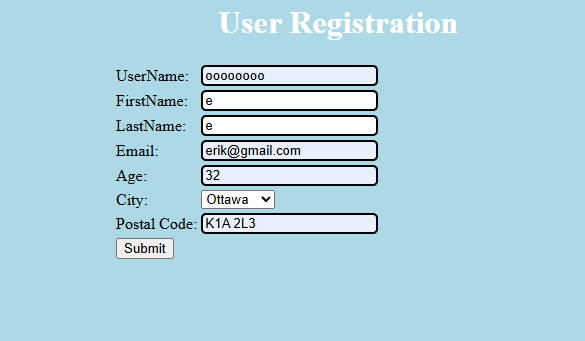
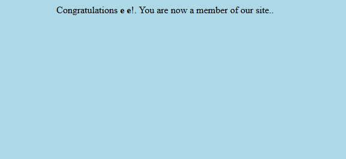
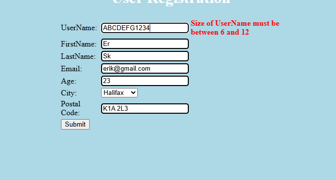
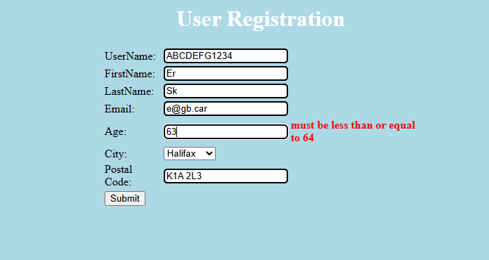
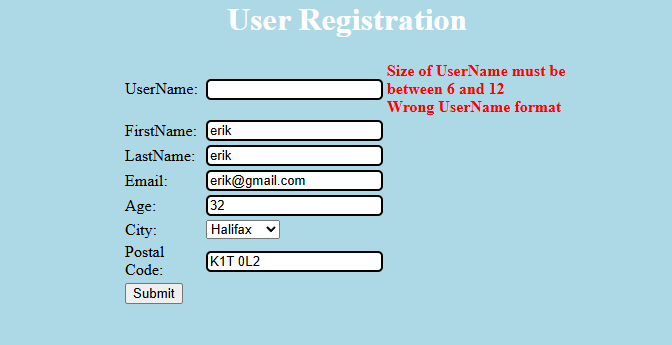
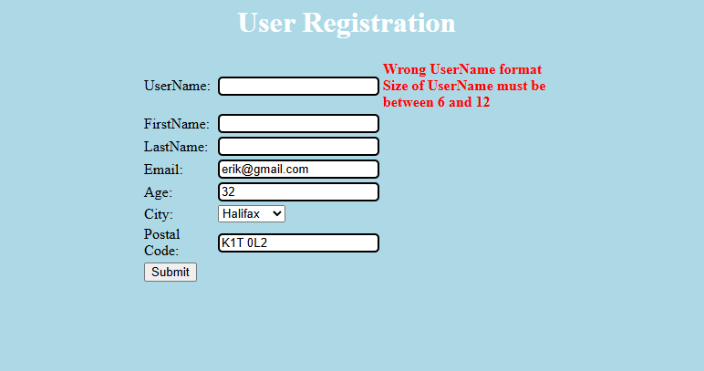
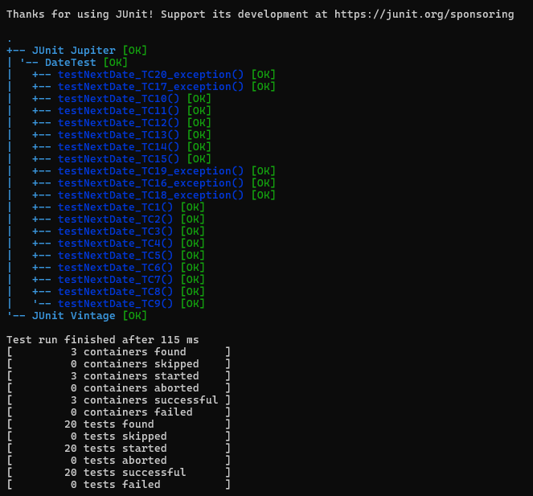
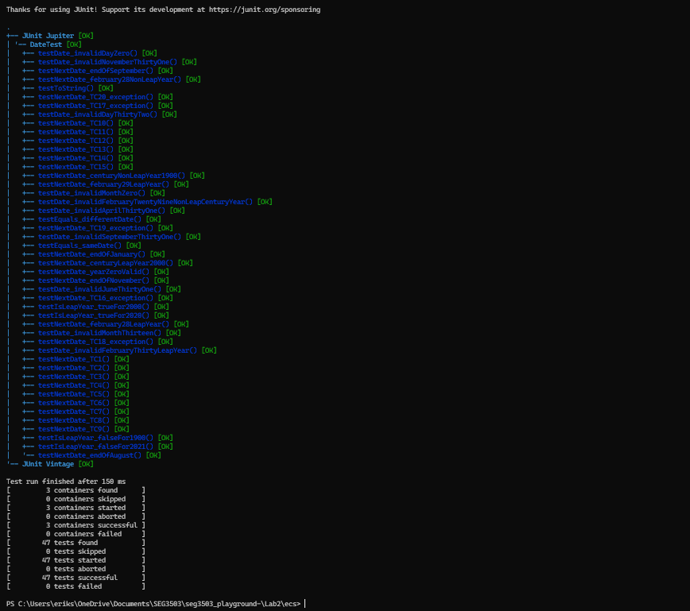

# SEG3503 - Laboratoire 2

| Nom | Numero d'etudiant | Cours | Groupe |
|---|---|---|---|
| Erik Skjenna | 300273106 | SEG3503 | 7 |

## Description du laboratoire

Ce laboratoire porte sur les tests logiciels appliqués à une application d'inscription d'utilisateur.

Le but principal est de documenter les cas de test manuels, de comparer les résultats attendus avec les résultats obtenus, et d'exécuter des tests automatisés avec JUnit.

Le laboratoire est divisé en deux exercices :

- **Exercise 1** : exécution de tests manuels sur l'application User Registration.
- **Exercise 2** : exécution de tests automatisés avec JUnit.

Ce fichier README résume le travail effectué, les résultats obtenus, les captures d'écran, ainsi que les commandes utilisées.

---

# Exercise 1

## Objectif

L'objectif de l'exercice 1 est d'exécuter manuellement plusieurs cas de test sur l'application **User Registration**.

Pour chaque cas de test, le résultat attendu est comparé avec le résultat réel obtenu dans l'application.  
Un verdict est ensuite donné : **Pass**, **Fail** ou **Inconclusive**.

---

## Tableau des résultats - Exercise 1

| Test Case | Expected Results | Actual Results / Screenshot | Verdict |
|---|---|---|---|
| 1 | accepted |   | Pass |
| 2 | accepted |   | Pass |
| 3 | accepted |   | Pass |
| 4 | Err1 |  | Fail |
| 5 | Err1 |  | Fail |

---

## Notes sur les résultats de l'exercice 1

Les trois premiers cas de test ont été acceptés comme prévu. Ils sont donc considérés comme réussis.

Les cas de test 4 et 5 ont échoué parce que le résultat obtenu ne correspond pas exactement au résultat attendu.

Dans ces cas, l'application a retourné plus d'erreurs que prévu. Par exemple, certains champs ont produit des messages supplémentaires comme une erreur de format ou une erreur de taille. C'est pour cette raison que le verdict est **Fail**.

# JUnit Parameterized Runner

## Objectif

Cette partie du laboratoire utilise JUnit afin d'automatiser l'exécution des tests.

Les tests paramétrés permettent de tester plusieurs entrées différentes avec une seule structure de test. Cela permet de réduire la répétition dans le code et de rendre les tests plus faciles à maintenir.

---

# Exercise 2

## Objectif

L'objectif de l'exercice 2 est d'exécuter des tests automatisés avec JUnit.

Les tests couvrent différents types de scénarios :

- les cas valides;
- les cas invalides;
- les cas qui ne doivent pas générer d'exception;
- les cas qui doivent générer une exception;
- les tests paramétrés.

---

## Tableau des résultats - Exercise 2

| Test Type | Screenshot | Result |
|---|---|---|
| JUnit Automated Tests |  | 20 tests successful, 0 tests failed |

---

## Résultat des tests automatisés

Les tests JUnit ont été exécutés avec succès.

Le résultat affiché dans le terminal montre que :

- 20 tests ont été trouvés;
- 20 tests ont été démarrés;
- 20 tests ont réussi;
- 0 test a échoué.

Cela confirme que les tests automatisés de l'exercice 2 fonctionnent correctement.

---

# Organisation du projet

| Fichier / Dossier | Description |
|---|---|
| `README.md` | Résumé du laboratoire et des résultats |
| `assets/` | Dossier contenant les captures d'écran |
| `src/` | Code source de l'application |
| `test/` | Tests JUnit |
| `lib/` | Librairies nécessaires pour JUnit |
| `bin/` | Fichiers compilés |

---

## Résultat des tests automatisés de surplus

Les tests JUnit ont été exécutés avec succès.

Le résultat affiché dans le terminal montre que :

- 47 tests ont été trouvés;
- 47 tests ont été démarrés;
- 47 tests ont réussi;
- 0 test a échoué.

Cela confirme que les tests automatisés de l'exercice 2 fonctionnent correctement.

---

### JUnit Test Results



---

# Structure recommandée du projet

Les captures d'écran doivent être placées dans le dossier `assets`.

Exemple de structure :

```txt
Lab2/
│
├── README.md
├── assets/
│   ├── pass1.png
│   ├── pass2.png
│   ├── pass3.png
│   ├── fail1.png
│   ├── fail2.png
│   ├── result1.png
│   ├── result2.png
│   ├── result3.png
│   └── junit-results.png
│
├── src/
├── test/
├── lib/
└── bin/
````

---

# Commandes utilisées

## Compilation du code source

```bash
javac -d bin src/*.java
```

---

## Compilation des tests

```bash
javac -cp "bin;lib/*" -d bin test/*.java
```

---

## Exécution des tests JUnit

```bash
java -jar lib/junit-platform-console-standalone-1.7.1.jar --class-path bin --scan-classpath --details tree
```

---

# Résumé des résultats

| Partie     | Résultat général                                                     |
| ---------- | -------------------------------------------------------------------- |
| Exercise 1 | Les tests manuels ont été exécutés et documentés                     |
| Exercise 2 | Les tests JUnit ont été exécutés avec succès                         |
| README     | Les résultats sont résumés avec des tableaux et des captures d'écran |

---

# Conclusion

Ce laboratoire a permis de pratiquer les tests manuels et les tests automatisés.

L'exercice 1 montre comment comparer les résultats attendus avec les résultats obtenus dans une application réelle. Certains cas de test ont réussi, tandis que d'autres ont échoué parce que les résultats obtenus ne correspondaient pas exactement aux résultats attendus.

L'exercice 2 montre comment utiliser JUnit pour automatiser l'exécution des tests. Les tests automatisés ont tous réussi, ce qui confirme que cette partie fonctionne correctement.

Les tableaux Markdown et les captures d'écran rendent le travail plus clair, plus structuré et plus facile à corriger.

```
```
