# SEG3503 Lab 04 - Développement piloté par les tests

## Informations de l'étudiant

| Champ             | Information                      |
| ----------------- | -------------------------------- |
| Nom               | Erik Skjenna                     |
| Numéro d'étudiant | 300273106                        |
| Cours             | SEG3503                          |
| Laboratoire       | Lab 04 - Test-Driven Development |
| Projet choisi     | tic_java                         |

---

## Description du laboratoire

Ce laboratoire avait pour objectif de pratiquer le développement piloté par les tests, aussi appelé TDD. Le travail a été réalisé en suivant le cycle **Rouge, Vert, Refactoriser**.

Le principe suivi était le suivant :

1. Écrire un test qui échoue.
2. Exécuter les tests JUnit et confirmer l'échec.
3. Faire un commit du test échoué.
4. Écrire le code minimal pour faire passer le test.
5. Exécuter les tests JUnit et confirmer la réussite.
6. Faire un commit du test réussi.
7. Améliorer le code si possible sans briser les tests.
8. Faire un commit de refactorisation lorsque nécessaire.

Le travail principal a été fait dans le projet `tic_java`.

---

## Structure du projet

```text
seg3503_playground/lab04/
├── README.md
├── images/
│   ├── group1-red.PNG
│   ├── group1-green.png
│   ├── group1-refactor.png
│   ├── group2-red2.PNG
│   ├── group2-green2.PNG
│   ├── group2-red.PNG
│   ├── group2-green.PNG
│   ├── group4-red.PNG
│   ├── group4-green.PNG
│   ├── group5-red.PNG
│   ├── group5-green.PNG
│   ├── group6-red.PNG
│   ├── group6-green.PNG
│   └── commit-history.PNG
└── tic_java/
    ├── src/
    │   └── tic/
    │       └── Tic.java
    └── test/
        └── tic/
            └── TicTest.java
```

---

# Groupes de commits TDD

## Groupe 1 - Initialisation et égalité du plateau

| Élément      | Information                                                                                                                                                                            |
| ------------ | -------------------------------------------------------------------------------------------------------------------------------------------------------------------------------------- |
| Objectif     | Vérifier qu'un plateau Tic peut être créé correctement et que deux plateaux identiques peuvent être comparés.                                                                          |
| Commit rouge | `ba2c497` - `RED: add equality tests for Tic board - JUnit: 3 tests, 2 failures`                                                                                                       |
| Commit vert  | `7858e6c` - `GREEN: implement equals and hashCode for Tic - JUnit: 3 tests passing`                                                                                                    |
| Résultat     | Les tests échouaient au départ parce que `equals()` et `hashCode()` n'étaient pas encore implémentées. Après l'implémentation, les deux plateaux identiques sont reconnus comme égaux. |

### Test rouge

<a href="images/group1-red.PNG">
  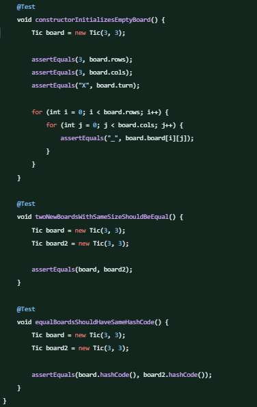
</a>

### Implémentation verte

<a href="images/group1-green.png">
  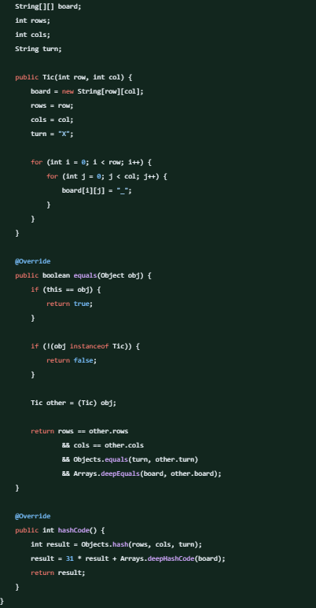
</a>

---

## Groupe 2 - Affichage du plateau avec toString()

| Élément                   | Information                                                                                                                                                                                                                                                        |
| ------------------------- | ------------------------------------------------------------------------------------------------------------------------------------------------------------------------------------------------------------------------------------------------------------------ |
| Objectif                  | Afficher le plateau sous forme de grille lisible avec la méthode `toString()`.                                                                                                                                                                                     |
| Commit rouge              | `53fac58` - `RED: add board display test - JUnit: 4 tests, 1 failure`                                                                                                                                                                                              |
| Commit vert               | `7ae9b9f` - `GREEN: implement board string display - JUnit: 4 tests passing`                                                                                                                                                                                       |
| Commit de refactorisation | `8d44f0e` - `REFACTOR: clean board initialization and display helpers - JUnit: 4 tests passing`                                                                                                                                                                    |
| Résultat                  | Le test échouait au départ parce que `toString()` n'affichait pas encore le plateau correctement. Après l'implémentation, le plateau est affiché comme une grille. Ensuite, le code a été refactorisé avec une méthode d'aide pour rendre l'affichage plus propre. |

### Test rouge

<a href="images/group2-red2.PNG">
  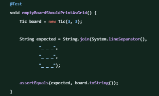
</a>

### Implémentation verte

<a href="images/group2-green2.PNG">
  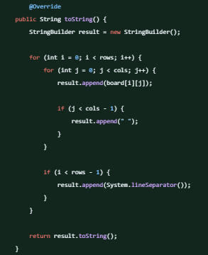
</a>

### Refactorisation

<a href="images/group1-refactor.png">
  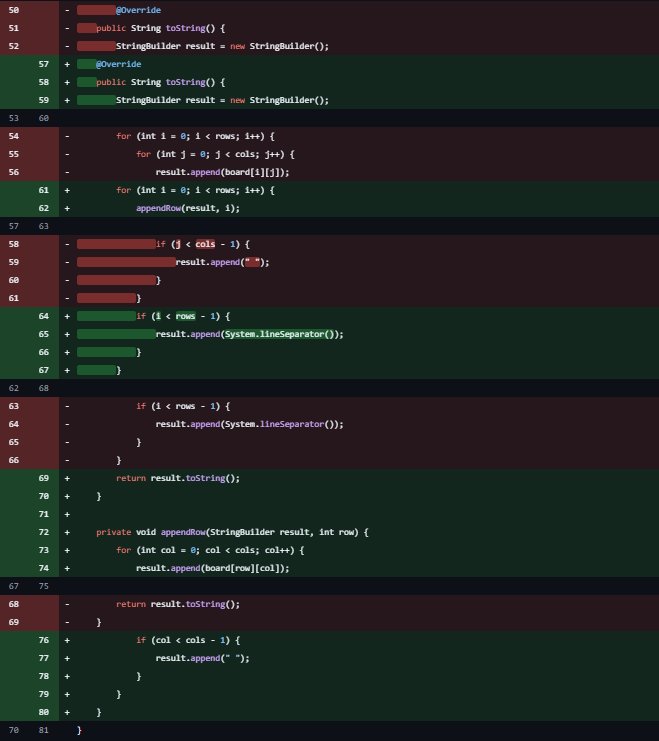
</a>

---

## Groupe 3 - Placement d'un coup

| Élément      | Information                                                                                                                                                                |
| ------------ | -------------------------------------------------------------------------------------------------------------------------------------------------------------------------- |
| Objectif     | Permettre au joueur courant de placer son symbole sur le plateau.                                                                                                          |
| Commit rouge | `d8e4175` - `RED: add valid move placement test - JUnit: 5 tests, 1 failure`                                                                                               |
| Commit vert  | `b6c0d54` - `GREEN: implement play method for valid moves - JUnit: 5 tests passing`                                                                                        |
| Résultat     | Le test échouait au départ parce que la méthode `play()` n'existait pas encore. Après l'implémentation, le joueur courant peut placer son symbole sur une case du plateau. |

### Test rouge

<a href="images/group2-red.PNG">
  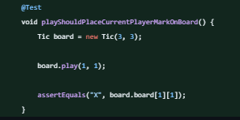
</a>

### Implémentation verte

<a href="images/group2-green.PNG">
  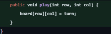
</a>

---

## Groupe 4 - Changement de tour

| Élément      | Information                                                                                                                                         |
| ------------ | --------------------------------------------------------------------------------------------------------------------------------------------------- |
| Objectif     | Alterner le tour entre `X` et `O` après chaque coup valide.                                                                                         |
| Commit rouge | `a264779` - `RED: add turn switching test - JUnit: 6 tests, 1 failure`                                                                              |
| Commit vert  | `6efb74e` - `GREEN: switch turns after valid moves - JUnit: 6 tests passing`                                                                        |
| Résultat     | Le test échouait au départ parce que le tour ne changeait pas après un coup. Après l'implémentation, le tour alterne correctement entre `X` et `O`. |

### Test rouge

<a href="images/group4-red.PNG">
  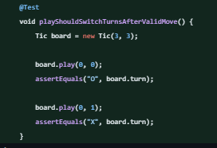
</a>

### Implémentation verte

<a href="images/group4-green.PNG">
  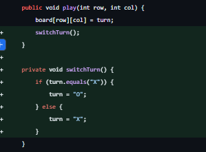
</a>

---

## Groupe 5 - Validation des cases occupées

| Élément      | Information                                                                                                                                                                                          |
| ------------ | ---------------------------------------------------------------------------------------------------------------------------------------------------------------------------------------------------- |
| Objectif     | Empêcher un joueur de jouer sur une case déjà occupée.                                                                                                                                               |
| Commit rouge | `d0844a3` - `RED: add occupied cell validation test - JUnit: 7 tests, 1 failure`                                                                                                                     |
| Commit vert  | `d668437` - `GREEN: reject moves on occupied cells - JUnit: 7 tests passing`                                                                                                                         |
| Résultat     | Le test échouait au départ parce qu'un joueur pouvait écraser une case déjà utilisée. Après l'ajout de la validation, une exception est lancée lorsqu'un joueur tente de jouer sur une case occupée. |

### Test rouge

<a href="images/group5-red.PNG">
  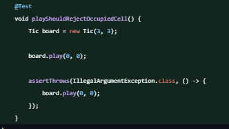
</a>

### Implémentation verte

<a href="images/group5-green.PNG">
  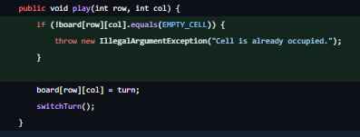
</a>

---

## Groupe 6 - Validation des coordonnées invalides

| Élément      | Information                                                                                                                                                                                           |
| ------------ | ----------------------------------------------------------------------------------------------------------------------------------------------------------------------------------------------------- |
| Objectif     | Empêcher un joueur de jouer à l'extérieur du plateau.                                                                                                                                                 |
| Commit rouge | `9d16945` - `RED: add invalid coordinate validation test - JUnit: 8 tests, 1 failure`                                                                                                                 |
| Commit vert  | `b0ada50` - `GREEN: reject moves outside the board - JUnit: 8 tests passing`                                                                                                                          |
| Résultat     | Le test échouait au départ parce que le programme ne gérait pas proprement les coordonnées invalides. Après l'ajout de la validation, les coups en dehors du plateau sont refusés avec une exception. |

### Test rouge

<a href="images/group6-red.PNG">
  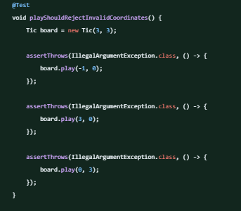
</a>

### Implémentation verte

<a href="images/group6-green.PNG">
  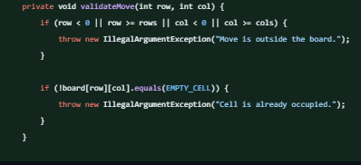
</a>

---

# Historique des commits

Cette section résume les commits importants visibles dans l'historique Git du projet.

| Hash      | Message de commit                                                                   | Rôle                                          |
| --------- | ----------------------------------------------------------------------------------- | --------------------------------------------- |
| `5423ff0` | `Initiate lab4 files`                                                               | Création initiale des fichiers du laboratoire |
| `c5ffff5` | `Create README.md`                                                                  | Création initiale du README                   |
| `ba2c497` | `RED: add equality tests for Tic board - JUnit: 3 tests, 2 failures`                | Groupe 1 - Test rouge                         |
| `7858e6c` | `GREEN: implement equals and hashCode for Tic - JUnit: 3 tests passing`             | Groupe 1 - Implémentation verte               |
| `53fac58` | `RED: add board display test - JUnit: 4 tests, 1 failure`                           | Groupe 2 - Test rouge                         |
| `7ae9b9f` | `GREEN: implement board string display - JUnit: 4 tests passing`                    | Groupe 2 - Implémentation verte               |
| `8d44f0e` | `REFACTOR: clean board initialization and display helpers - JUnit: 4 tests passing` | Groupe 2 - Refactorisation                    |
| `3cc46b1` | `Update README with commit history and JUnit results`                               | Mise à jour de la documentation               |
| `86878df` | `Revise README with TDD details and student info`                                   | Mise à jour de la documentation               |
| `34d2eb9` | `Create Tic.class`                                                                  | Ajout d'un fichier compilé                    |
| `d8e4175` | `RED: add valid move placement test - JUnit: 5 tests, 1 failure`                    | Groupe 3 - Test rouge                         |
| `b6c0d54` | `GREEN: implement play method for valid moves - JUnit: 5 tests passing`             | Groupe 3 - Implémentation verte               |
| `a264779` | `RED: add turn switching test - JUnit: 6 tests, 1 failure`                          | Groupe 4 - Test rouge                         |
| `6efb74e` | `GREEN: switch turns after valid moves - JUnit: 6 tests passing`                    | Groupe 4 - Implémentation verte               |
| `d0844a3` | `RED: add occupied cell validation test - JUnit: 7 tests, 1 failure`                | Groupe 5 - Test rouge                         |
| `d668437` | `GREEN: reject moves on occupied cells - JUnit: 7 tests passing`                    | Groupe 5 - Implémentation verte               |
| `9d16945` | `RED: add invalid coordinate validation test - JUnit: 8 tests, 1 failure`           | Groupe 6 - Test rouge                         |
| `b0ada50` | `GREEN: reject moves outside the board - JUnit: 8 tests passing`                    | Groupe 6 - Implémentation verte               |

---

## Capture de l'historique Git

<a href="images/commit-history.PNG">
  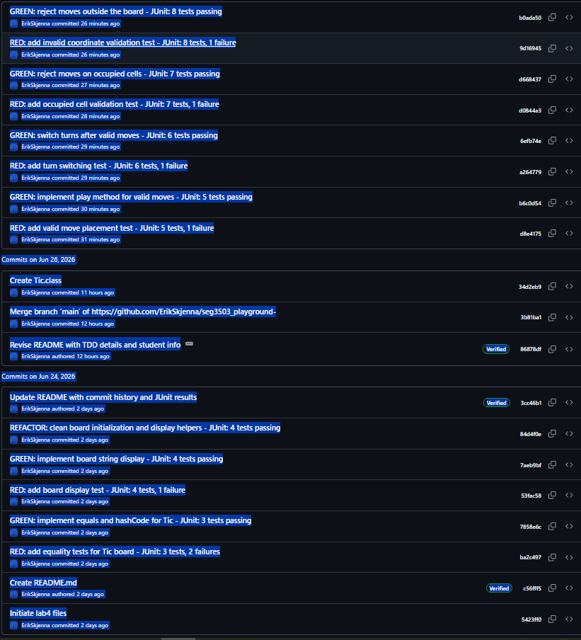
</a>

---

# Résumé du cycle TDD

| Étape        | Explication                                                                                                                              |
| ------------ | ---------------------------------------------------------------------------------------------------------------------------------------- |
| Rouge        | Un test est ajouté pour représenter une fonctionnalité désirée. Le test échoue parce que la fonctionnalité n'est pas encore implémentée. |
| Vert         | Le code minimal est ajouté pour faire passer le test.                                                                                    |
| Refactoriser | Le code est amélioré sans changer son comportement. Les tests doivent continuer à réussir.                                               |

---

## Conclusion

Ce laboratoire m'a permis de pratiquer le développement piloté par les tests avec JUnit. J'ai commencé par écrire des tests qui échouaient, puis j'ai ajouté le code nécessaire pour les faire passer. Lorsque c'était possible, j'ai ensuite amélioré la structure du code sans changer son comportement.

Le projet respecte donc le cycle TDD : **Rouge, Vert, Refactoriser**.
