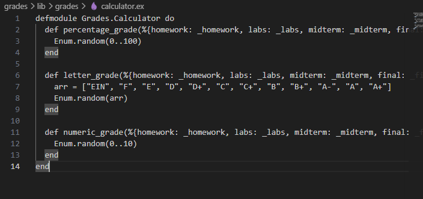
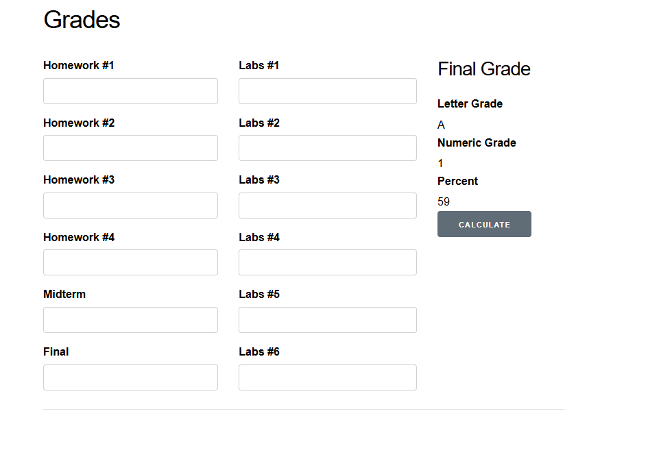
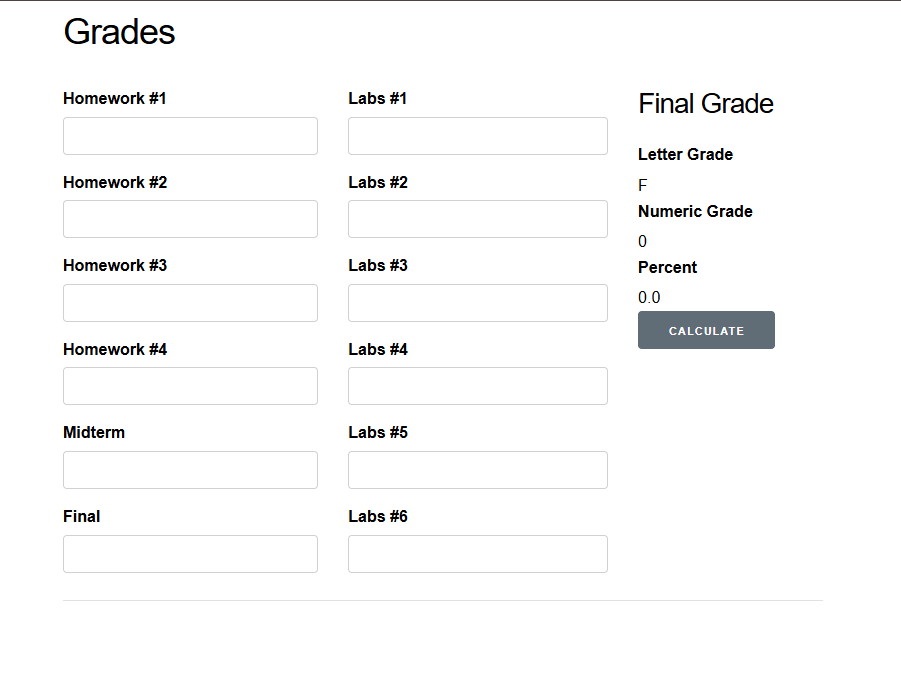
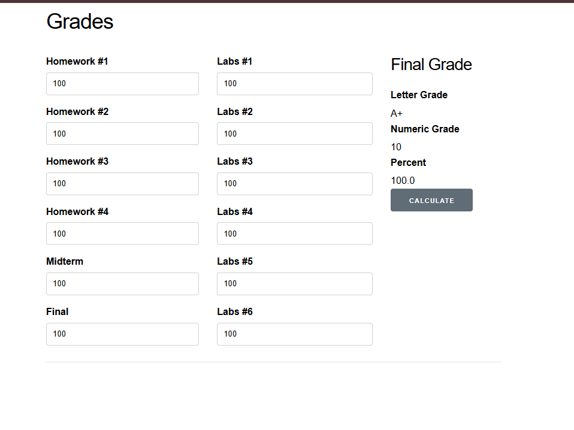
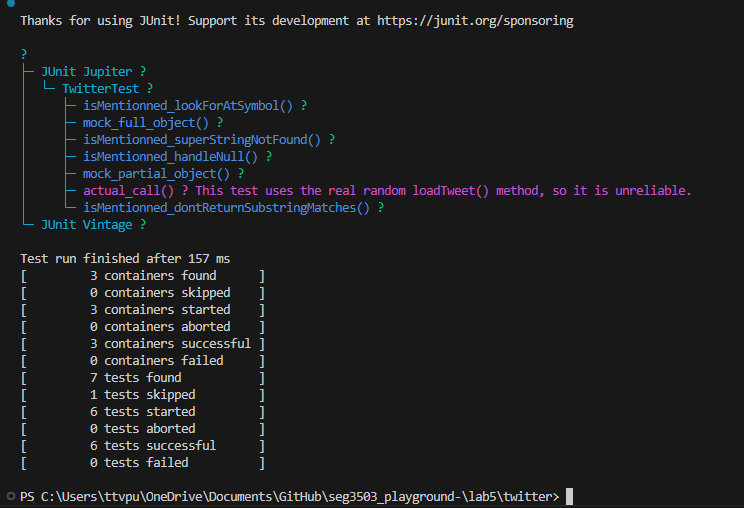

# SEG3503 - Laboratoire 05  
## Stubs, Mocks et Architecture

**Nom :** Erik Skjenna  
**Cours :** SEG3503  
**Laboratoire :** Lab 05 - Mocks et Stubs  

Lien du dépôt GitHub :  
https://github.com/ErikSkjenna/SEG3503_Lab5

Lien du dépôt créé accidentellement :  
https://github.com/ErikSkjenna/SEG3503_Lab5

---

## 1. Introduction

Ce laboratoire portait sur l’utilisation de stubs et de mocks dans deux petits projets.  
Le but était de comprendre comment faire fonctionner une application même lorsqu’une partie du code n’est pas encore prête, puis comment tester une méthode sans dépendre d’un comportement aléatoire.

Le laboratoire était divisé en deux parties :

1. Le projet `grades`, où il fallait créer un stub temporaire pour le calcul des notes, puis le remplacer par une vraie implémentation.
2. Le projet `twitter`, où il fallait utiliser des mocks pour tester la méthode `isMentionned()`.

---

# Partie 1 - Projet Grades

## 2. Exécution initiale

Pour commencer, j’ai placé le projet `grades` dans mon dossier de laboratoire.  
Ensuite, j’ai installé les dépendances et lancé le serveur Phoenix.

Commandes utilisées :

```bash
cd grades
mix deps.get
cd assets
npm install
cd ..
mix phx.server
```

L’application était accessible à l’adresse suivante :

```text
http://localhost:4000
```

Au début, l’application ne fonctionnait pas correctement lorsque je cliquais sur le bouton **Calculate**.  
L’erreur venait du fait que le module `Grades.Calculator` n’existait pas encore.

Erreur observée :

```text
function Grades.Calculator.letter_grade/1 is undefined
```

Cela voulait dire que la page essayait d’appeler une fonction qui n’était pas encore implémentée.

---

## 3. Création du stub

Pour régler le problème temporairement, j’ai créé le fichier suivant :

```text
lib/grades/calculator.ex
```

J’ai ensuite ajouté un module temporaire `Grades.Calculator`.

Le but du stub n’était pas de calculer une vraie note.  
Il servait seulement à permettre à l’application de fonctionner sans erreur.

### Capture du code stub



Code du stub :

```elixir
defmodule Grades.Calculator do
  def percentage_grade(%{homework: _homework, labs: _labs, midterm: _midterm, final: _final}) do
    Enum.random(0..100)
  end

  def letter_grade(%{homework: _homework, labs: _labs, midterm: _midterm, final: _final}) do
    arr = ["EIN", "F", "E", "D", "D+", "C", "C+", "B", "B+", "A-", "A", "A+"]
    Enum.random(arr)
  end

  def numeric_grade(%{homework: _homework, labs: _labs, midterm: _midterm, final: _final}) do
    Enum.random(0..10)
  end
end
```

Après avoir ajouté ce stub, l’application ne plantait plus.  
Les résultats affichés étaient aléatoires, ce qui était normal puisque le code était temporaire.

### Capture du résultat avec le stub



---

## 4. Observations avec le stub

Avec le stub, l’application pouvait fonctionner, mais les résultats n’étaient pas fiables.

Par exemple, si j’entrais les mêmes notes plusieurs fois, les résultats pouvaient changer à chaque clic, parce que les fonctions retournaient des valeurs aléatoires.

Le stub était quand même utile, car il permettait de vérifier que la page appelait bien les trois fonctions suivantes :

```text
percentage_grade
letter_grade
numeric_grade
```

Cela montre qu’un stub peut servir à débloquer temporairement le développement, même si la vraie logique n’est pas encore terminée.

---

## 5. Remplacement du stub par un vrai calculateur

Après avoir confirmé que le stub fonctionnait, j’ai remplacé le code temporaire par une vraie implémentation.

Le calculateur utilise les pondérations suivantes :

```text
Devoirs : 25 %
Laboratoires : 25 %
Examen intra : 20 %
Examen final : 30 %
```

### Capture du code final du calculateur





Code final du calculateur :

```elixir
defmodule Grades.Calculator do
  @homework_weight 0.25
  @labs_weight 0.25
  @midterm_weight 0.20
  @final_weight 0.30

  def percentage_grade(grades) do
    homework_average = average(Map.get(grades, :homework, []))
    labs_average = average(Map.get(grades, :labs, []))
    midterm = to_number(Map.get(grades, :midterm, 0))
    final = to_number(Map.get(grades, :final, 0))

    percentage =
      homework_average * @homework_weight +
      labs_average * @labs_weight +
      midterm * @midterm_weight +
      final * @final_weight

    Float.round(percentage, 2)
  end

  def letter_grade(grades) do
    percentage_grade(grades)
    |> letter_from_percentage()
  end

  def numeric_grade(grades) do
    percentage_grade(grades)
    |> numeric_from_percentage()
  end

  defp average(values) do
    numbers =
      values
      |> Enum.map(&to_number/1)

    case numbers do
      [] -> 0.0
      _ -> Enum.sum(numbers) / length(numbers)
    end
  end

  defp to_number(nil), do: 0.0
  defp to_number(""), do: 0.0

  defp to_number(value) when is_integer(value), do: value * 1.0
  defp to_number(value) when is_float(value), do: value

  defp to_number(value) when is_binary(value) do
    value
    |> String.trim()
    |> String.replace("%", "")
    |> Float.parse()
    |> case do
      {number, _rest} -> clamp(number)
      :error -> 0.0
    end
  end

  defp to_number(_value), do: 0.0

  defp clamp(number) when number < 0, do: 0.0
  defp clamp(number) when number > 100, do: 100.0
  defp clamp(number), do: number

  defp letter_from_percentage(percentage) when percentage >= 90, do: "A+"
  defp letter_from_percentage(percentage) when percentage >= 85, do: "A"
  defp letter_from_percentage(percentage) when percentage >= 80, do: "A-"
  defp letter_from_percentage(percentage) when percentage >= 75, do: "B+"
  defp letter_from_percentage(percentage) when percentage >= 70, do: "B"
  defp letter_from_percentage(percentage) when percentage >= 65, do: "C+"
  defp letter_from_percentage(percentage) when percentage >= 60, do: "C"
  defp letter_from_percentage(percentage) when percentage >= 55, do: "D+"
  defp letter_from_percentage(percentage) when percentage >= 50, do: "D"
  defp letter_from_percentage(percentage) when percentage >= 40, do: "E"
  defp letter_from_percentage(_percentage), do: "F"

  defp numeric_from_percentage(percentage) when percentage >= 90, do: 10
  defp numeric_from_percentage(percentage) when percentage >= 85, do: 9
  defp numeric_from_percentage(percentage) when percentage >= 80, do: 8
  defp numeric_from_percentage(percentage) when percentage >= 75, do: 7
  defp numeric_from_percentage(percentage) when percentage >= 70, do: 6
  defp numeric_from_percentage(percentage) when percentage >= 65, do: 5
  defp numeric_from_percentage(percentage) when percentage >= 60, do: 4
  defp numeric_from_percentage(percentage) when percentage >= 55, do: 3
  defp numeric_from_percentage(percentage) when percentage >= 50, do: 2
  defp numeric_from_percentage(percentage) when percentage >= 40, do: 1
  defp numeric_from_percentage(_percentage), do: 0
end
```

---

## 6. Résultat avec le vrai calculateur

Après avoir remplacé le stub par le vrai calculateur, les résultats sont devenus cohérents.  
Contrairement au stub, les mêmes notes donnent toujours le même résultat.

Par exemple, avec des notes vides ou des valeurs à zéro, le système retourne une note de départ cohérente.

### Capture du résultat avec le vrai calculateur



Cette partie montre clairement la différence entre le stub et la vraie implémentation.  
Le stub servait seulement à faire fonctionner l’application temporairement, tandis que le vrai calculateur contient la logique du système.

---

# Partie 2 - Projet Twitter

## 7. Exécution initiale du projet Twitter

Pour le projet `twitter`, j’ai commencé par exécuter l’application avec la commande suivante :

```bash
./bin/run
```

L’application affichait parfois :

```text
Twitter Text Feed
Hello to @you
```

ou :

```text
Twitter Text Feed
I am tweet that likes to talk about @me
```

Le comportement était aléatoire, car la méthode `loadTweet()` utilise `Math.random()`.

---

## 8. Problème avec le test réel

Le test `actual_call()` utilise directement la vraie méthode `loadTweet()`.  
Ce test n’est pas fiable parce que `loadTweet()` peut retourner plusieurs valeurs différentes :

```text
I am tweet that likes to talk about @me
Hello to @you
null
```

À cause de cela, le test peut réussir une fois et échouer une autre fois sans que le code ait changé.

Pour éviter ce problème, j’ai utilisé des mocks avec EasyMock.  
Les mocks permettent de contrôler exactement ce que `loadTweet()` retourne pendant un test.

---

## 9. Tests avec EasyMock

Les quatre cas demandés dans le laboratoire étaient :

```text
1. Vérifier que le symbole @ est pris en compte.
2. Vérifier qu'une sous-chaîne ne compte pas comme une mention complète.
3. Vérifier qu'un nom plus long n'est pas trouvé par erreur.
4. Vérifier le cas où le tweet est null.
```

### Capture du code des tests Twitter


Code final de `TwitterTest.java` :

```java
import static org.junit.jupiter.api.Assertions.assertEquals;

import org.junit.jupiter.api.Disabled;
import org.junit.jupiter.api.Test;

import static org.easymock.EasyMock.*;

class TwitterTest {

    @Disabled("This test uses the real random loadTweet() method, so it is unreliable.")
    @Test
    void actual_call() {

        Twitter twitter = new Twitter();

        boolean actual;

        actual = twitter.isMentionned("me");
        assertEquals(true, actual);
    }

    @Test
    void mock_full_object() {

        Twitter twitter = createMock("twitter", Twitter.class);

        expect(twitter.loadTweet()).andReturn("hello @me");
        expect(twitter.loadTweet()).andReturn("hello @you");
        replay(twitter);

        String actual;

        actual = twitter.loadTweet();
        assertEquals("hello @me", actual);

        actual = twitter.loadTweet();
        assertEquals("hello @you", actual);
    }

    @Test
    void mock_partial_object() {

        Twitter twitter = partialMockBuilder(Twitter.class)
          .addMockedMethod("loadTweet")
          .createMock();

        expect(twitter.loadTweet()).andReturn("hello @me").times(2);
        replay(twitter);

        boolean actual;

        actual = twitter.isMentionned("me");
        assertEquals(true, actual);

        actual = twitter.isMentionned("you");
        assertEquals(false, actual);
    }

    @Test
    void isMentionned_lookForAtSymbol() {

        Twitter twitter = partialMockBuilder(Twitter.class)
          .addMockedMethod("loadTweet")
          .createMock();

        expect(twitter.loadTweet()).andReturn("hello @me").times(2);
        replay(twitter);

        boolean actual;

        actual = twitter.isMentionned("me");
        assertEquals(true, actual);

        actual = twitter.isMentionned("you");
        assertEquals(false, actual);
    }

    @Test
    void isMentionned_dontReturnSubstringMatches() {

        Twitter twitter = partialMockBuilder(Twitter.class)
          .addMockedMethod("loadTweet")
          .createMock();

        expect(twitter.loadTweet()).andReturn("hello @meat").times(2);
        replay(twitter);

        boolean actual;

        actual = twitter.isMentionned("me");
        assertEquals(false, actual);

        actual = twitter.isMentionned("meat");
        assertEquals(true, actual);
    }

    @Test
    void isMentionned_superStringNotFound() {

        Twitter twitter = partialMockBuilder(Twitter.class)
          .addMockedMethod("loadTweet")
          .createMock();

        expect(twitter.loadTweet()).andReturn("hello @me").times(2);
        replay(twitter);

        boolean actual;

        actual = twitter.isMentionned("me");
        assertEquals(true, actual);

        actual = twitter.isMentionned("meat");
        assertEquals(false, actual);
    }

    @Test
    void isMentionned_handleNull() {

        Twitter twitter = partialMockBuilder(Twitter.class)
          .addMockedMethod("loadTweet")
          .createMock();

        expect(twitter.loadTweet()).andReturn(null).times(2);
        replay(twitter);

        boolean actual;

        actual = twitter.isMentionned("me");
        assertEquals(false, actual);

        actual = twitter.isMentionned("meat");
        assertEquals(false, actual);
    }
}
```

---

## 10. Correction de Twitter.java

Le problème principal dans `Twitter.java` était que la méthode `isMentionned()` pouvait retourner un mauvais résultat dans certains cas.

Par exemple :

```text
hello @meat
```

Dans ce cas, chercher `me` ne devrait pas retourner `true`, car la mention complète est `@meat`, pas `@me`.

J’ai donc modifié la méthode pour extraire la mention complète après le symbole `@`, puis comparer cette mention avec le nom recherché.

### Capture de la correction dans Twitter.java


Code final de `Twitter.java` :

```java
public class Twitter {

  public String loadTweet()
  {
    try {
      Thread.sleep(4000);
    } catch (InterruptedException e) {}

    double r = Math.random();
    if (r <= 0.45) {
      return "I am tweet that likes to talk about @me";
    } else if (r <= 0.9) {
      return "Hello to @you";
    } else {
      return null;
    }
  }

  public boolean isMentionned(String name) {
    String tweet = loadTweet();

    if (tweet == null) {
      return false;
    }

    int k = tweet.indexOf("@");

    if (k == -1) {
      return false;
    }

    String temp = "";

    for (int i = k; i < tweet.length(); i++) {
      if (tweet.charAt(i) == ' ') {
        break;
      }

      temp = temp + tweet.charAt(i);
    }

    return temp.equals("@" + name);
  }

}
```

---

## 11. Problème EasyMock avec Java

Pendant l’exécution des tests, j’ai rencontré une erreur liée à EasyMock :

```text
java.lang.reflect.InaccessibleObjectException
module java.base does not "opens java.lang" to unnamed module
```

Pour régler ce problème, j’ai ajouté l’option suivante à la commande de test :

```text
--add-opens java.base/java.lang=ALL-UNNAMED
```

Cette option permet à EasyMock de fonctionner avec ma version de Java.

---

## 12. Résultats des tests Twitter

Commande utilisée :

```bash
./bin/test
```

Résultat obtenu :

```text
7 tests found
1 tests skipped
6 tests successful
0 tests failed
```

Le test ignoré est `actual_call()`, car il utilise la vraie méthode `loadTweet()`, qui dépend de `Math.random()`.  
Les autres tests utilisent des mocks, donc les résultats sont contrôlés et stables.

### Capture du résultat des tests Twitter


---

## 13. Analyse des résultats

Les mocks ont permis de tester la méthode `isMentionned()` de façon plus contrôlée.

Sans mock, le test dépendait du hasard parce que `loadTweet()` utilise `Math.random()`.  
Avec EasyMock, il était possible de décider exactement quel tweet devait être retourné.

Les tests ont permis de vérifier deux problèmes importants :

1. La méthode devait retourner `false` si le tweet était `null`.
2. La méthode ne devait pas considérer `@meat` comme une mention de `@me`.

Après correction, la méthode vérifie mieux la mention complète au lieu de simplement chercher une sous-chaîne dans le tweet.

---

## 14. Commandes Git utilisées

Pendant le laboratoire, j’ai fait des commits pour sauvegarder les étapes importantes.

Exemples de commandes utilisées :

```bash
git add .
git commit -m "Add calculator stub"

git add .
git commit -m "Replace calculator stub with working implementation"

git add .
git commit -m "Add Twitter mock tests and fix isMentionned"
```

### Capture de l’historique Git


---

## 15. Conclusion

Ce laboratoire m’a permis de mieux comprendre la différence entre un stub et un mock.

Un stub est utile pour remplacer temporairement une partie du système qui n’est pas encore prête.  
Dans le projet `grades`, le stub a permis de faire fonctionner l’application même si le vrai calculateur n’existait pas encore.

Un mock est utile pour tester une méthode dans un contexte contrôlé.  
Dans le projet `twitter`, les mocks ont permis de tester `isMentionned()` sans dépendre de la méthode aléatoire `loadTweet()`.

Au final, ce laboratoire montre que les stubs et les mocks sont pratiques pour isoler certaines parties du code, tester plus facilement, et éviter que les tests dépendent de comportements externes ou imprévisibles.
